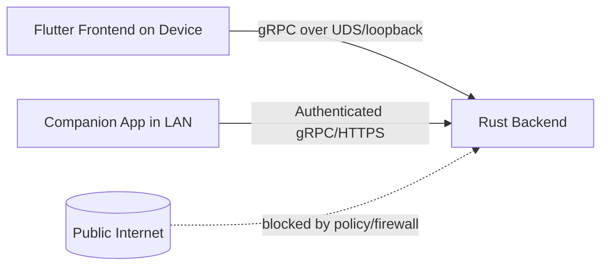

# 03 Context and Scope

The CarPC system runs as a standalone unit inside the vehicle. Its primary actors include:

* **Driver/Passenger** – interacts with the touchscreen UI for navigation, media, and settings.
* **Vehicle** – provides sensor data via the CAN bus and receives control commands (e.g., display backlighting).
* **External services** – map APIs, update servers, and media streaming sources accessed over Wi‑Fi or mobile tethering.

Scope of this documentation is limited to the software architecture; hardware details (mounts, wiring) are out of scope. It also focuses on the on‑device components; companion mobile apps or cloud backend are not covered.

The system consists of two main blocks:

* **Flutter frontend** – UI layer running in a Linux window with access to touchscreen input.
* **Rust backend** – headless service handling business logic, CAN communication, data storage, and network I/O.

Interaction between the two uses gRPC over a local socket (Unix domain socket or TCP loopback) to enable strongly‑typed messages and better performance.

## Security Boundary (LAN-only Remote Access)

The primary control path remains on-device: Flutter frontend to Rust backend over local IPC.
Future remote control access is explicitly limited to the local network (LAN) and is not intended to be reachable from the public internet.

### Boundary Rules

1. Backend control interfaces must not be exposed directly to WAN/public internet.
2. Remote access is allowed only from trusted LAN segments (or VPN terminating into LAN).
3. All LAN-exposed control endpoints require authentication and authorization.
4. On-device frontend-backend communication uses local IPC with strict socket permissions.
5. OTA and external API communication are outbound-initiated by the device; inbound internet control is out of scope.
