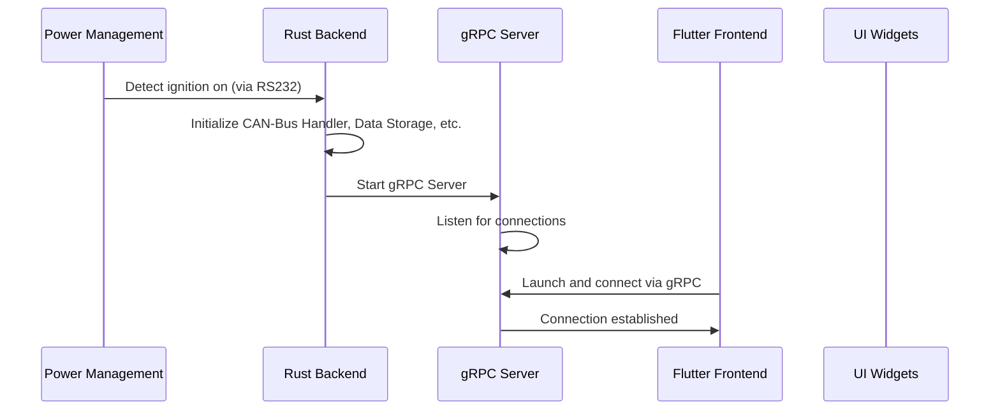
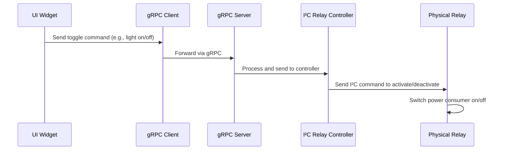

# 06 Runtime View

The Runtime View describes the dynamic behavior of the system at runtime. It illustrates how components interact over time, including sequences of operations, state changes, and data flows. This view complements the static Building Block View by showing "how" and "when" things happen, often using sequence diagrams, activity diagrams, or state machines.

## Key Scenarios

### Scenario 1: System Startup

When the car is started (ignition on detected via RS232 power supply):

1. Power Management detects ignition signal.
2. Rust Backend initializes CAN-Bus Handler, Data Storage, Network Manager, etc.
3. gRPC Server starts and listens for connections.
4. Flutter Frontend launches in Linux window, connects to gRPC Server.
5. UI loads initial state (e.g., navigation map, media controls).

### Scenario 2: Navigation Request

User selects destination in Flutter UI:

1. UI Widget sends request via gRPC Client to Backend.
2. gRPC Server receives request, forwards to Navigation Service.
3. Navigation Service queries map data from Network Manager (if online) or cached Data Storage.
4. Calculated route is sent back via gRPC to Frontend.
5. UI updates map display with route.

### Scenario 3: Media Playback

User starts playing audio:

1. UI Widget triggers request to Media Processor via gRPC.
2. Media Processor accesses Media Library for file/stream.
3. Audio decoding begins, output sent to system audio.
4. UI shows playback controls and progress.

### Scenario 4: Vehicle Data Display

CAN-Bus data updates:

1. CAN-Bus Handler continuously reads vehicle telemetry (speed, RPM).
2. Data is processed and sent via gRPC to Frontend.
3. UI Widgets update displays in real-time.

### Scenario 6: Relay Control

User toggles a relay (e.g., interior light) via UI:

1. UI Widget sends toggle command via gRPC Client.
2. gRPC Server forwards to I²C Relay Controller.
3. Controller sends I²C command to activate/deactivate the specific relay.
4. Physical relay switches the power consumer on/off.

## Diagrams

### Sequence Diagram: System Startup

### Sequence Diagram: Relay Control

(Additional diagrams for other scenarios can be added here.)

This view can be expanded with detailed UML diagrams as the system evolves.
