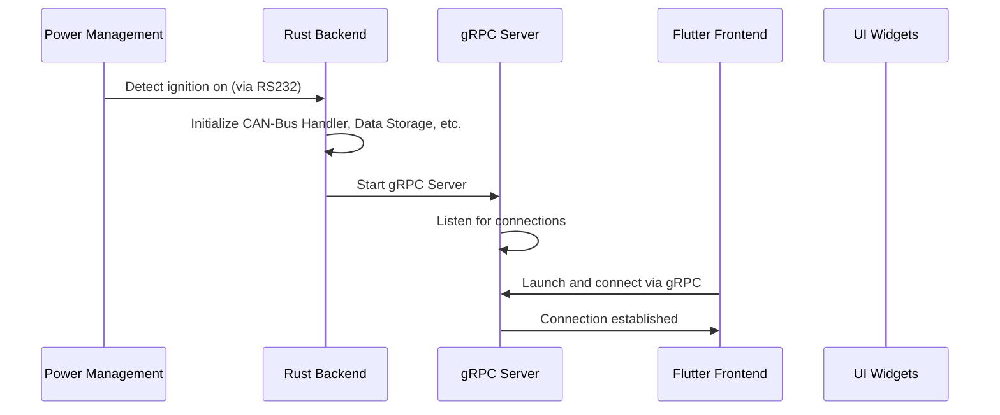
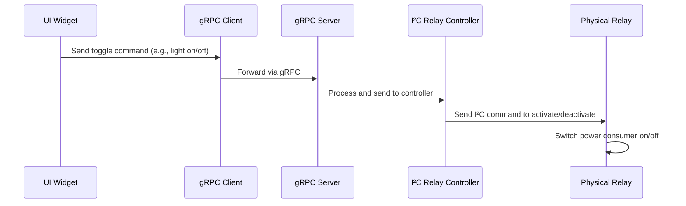

# 06 Runtime View

The Runtime View describes the dynamic behavior of the system at runtime. It illustrates how components interact over time, including sequences of operations, state changes, and data flows. This view complements the static Building Block View by showing "how" and "when" things happen, often using sequence diagrams, activity diagrams, or state machines.

## Key Scenarios

### Scenario 1: System Startup

When the car is started (ignition on detected via RS232 power supply):

1. Power Management detects ignition signal.
2. Rust Backend initializes CAN-Bus Handler, Data Storage, Network Manager, etc.
3. gRPC Server starts and listens for connections.
4. Flutter Frontend launches in Linux window, connects to gRPC Server.
5. UI loads initial state (e.g., navigation map, media controls).

### Scenario 2: Navigation Request

User selects destination in Flutter UI:

1. UI Widget sends request via gRPC Client to Backend.
2. gRPC Server receives request, forwards to Navigation Service.
3. Navigation Service queries map data from Network Manager (if online) or cached Data Storage.
4. Calculated route is sent back via gRPC to Frontend.
5. UI updates map display with route.

### Scenario 3: Media Playback

User starts playing audio:

1. UI Widget triggers request to Media Processor via gRPC.
2. Media Processor accesses Media Library for file/stream.
3. Audio decoding begins, output sent to system audio.
4. UI shows playback controls and progress.

### Scenario 3a: Media Library Rescan

The user explicitly starts a complete rescan:

1. The frontend requests a rescan for one or more configured media sources.
2. The Media Service rejects or defers the operation while playback is active.
3. The Media Library scans supported local audio files and reads their metadata.
4. Valid files are inserted or updated in SQLite.
5. Unreadable files are skipped and reported as errors on the library stream.
6. Files missing from an available source become `MISSING`.
7. Entries belonging to a detached source remain available as `OFFLINE`.
8. The library stream reports progress and completion to the frontend.

### Scenario 3b: Playlist Restore

The backend restores the persistent playback context during startup:

1. The backend loads the active playlist and saved resume state from SQLite.
2. The playlist is restored even when its source is currently offline.
3. The saved queue context selects the stored playlist entry and position.
4. The configured resume mode decides whether playback remains paused, starts,
   or starts at the beginning of the stored track.
5. The player stream sends an initial complete state to the frontend.

Playback progress is persisted only while playing. A periodic write occurs
every ten seconds and stores the last known position from before the current
interval. An explicit seek, when added to the control API, is stored
immediately. A stop resets the current position to the beginning but does not
modify the queue.

### Scenario 4: Vehicle Data Display

CAN-Bus data updates:

1. CAN-Bus Handler continuously reads vehicle telemetry (speed, RPM).
2. Data is processed and sent via gRPC to Frontend.
3. UI Widgets update displays in real-time.

### Scenario 5: Relay Control

User toggles a relay (e.g., interior light) via UI:

1. UI Widget sends toggle command via gRPC Client.
2. gRPC Server forwards to I²C Relay Controller.
3. Controller sends I²C command to activate/deactivate the specific relay.
4. Physical relay switches the power consumer on/off.

## Diagrams

### Sequence Diagram: System Startup

```mermaid
sequenceDiagram
    participant PM as Power Management
    participant RB as Rust Backend
    participant GS as gRPC Server
    participant FF as Flutter Frontend
    participant UI as UI Widgets

    PM->>RB: Detect ignition on (via RS232)
    RB->>RB: Initialize CAN-Bus Handler, Data Storage, etc.
    RB->>GS: Start gRPC Server
    GS->>GS: Listen for connections
    FF->>GS: Launch and connect via gRPC
    GS->>FF: Connection established
```

### Sequence Diagram: Relay Control

```mermaid
sequenceDiagram
    participant UIW as UI Widget
    participant GC as gRPC Client
    participant GS as gRPC Server
    participant IRC as I²C Relay Controller
    participant Relay as Physical Relay

    UIW->>GC: Send toggle command (e.g., light on/off)
    GC->>GS: Forward via gRPC
    GS->>IRC: Process and send to controller
    IRC->>Relay: Send I²C command to activate/deactivate
    Relay->>Relay: Switch power consumer on/off
```

(Additional diagrams for other scenarios can be added here.)

This view can be expanded with detailed UML diagrams as the system evolves.
