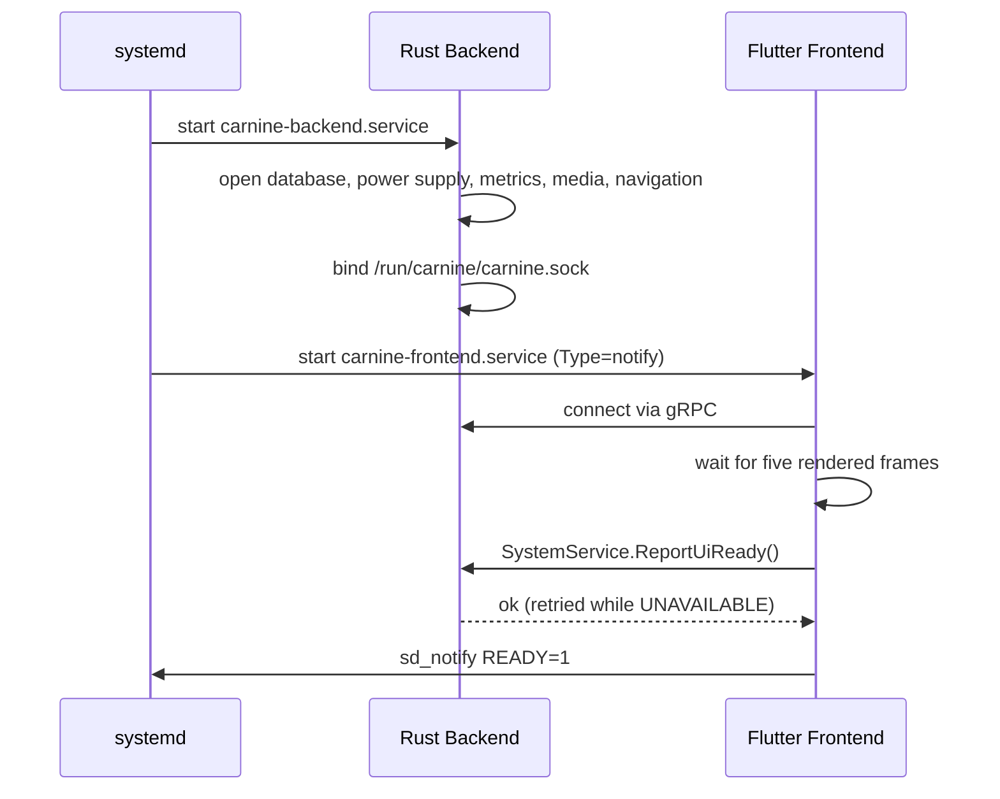
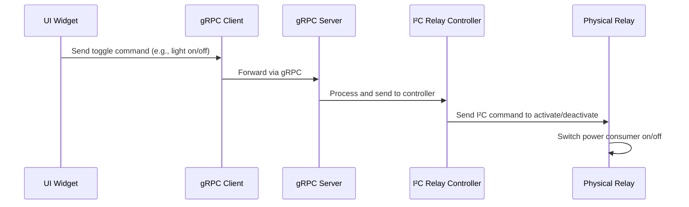

# 06 Runtime View

The Runtime View describes the dynamic behavior of the system at runtime. It illustrates how components interact over time, including sequences of operations, state changes, and data flows. This view complements the static Building Block View by showing "how" and "when" things happen, often using sequence diagrams, activity diagrams, or state machines.

## Key Scenarios

### Scenario 1: System Startup

When the Pi is powered (in the car: the power supply AuPrV1_1 switches it on
with the ignition, docs/23), systemd starts both services:

1. `carnine-backend.service` (`Type=simple`) starts the backend. It opens the
   SQLite database, opens the power supply line if `[power_supply]` is
   configured, starts the system metrics sampler, creates the media player,
   restores the volume and the saved resume state, starts the UDisks2 listener
   and the navigation service, and finally binds the Unix socket
   (`/run/carnine/carnine.sock`, optionally also a TCP address).
2. `carnine-frontend.service` (`Type=notify`, after the backend and
   `plymouth-start.service`) launches ivi-homescreen with the Flutter bundle
   and connects to the socket.
3. The UI waits for five rendered frames (it forces a frame every 100 ms and
   stops waiting after 5 s at the latest) and then reports `ReportUiReady` through
   `SystemService`. While the backend still answers `UNAVAILABLE`,
   `UiReadinessReporter` retries (250 ms, 500 ms, 1 s, then every 2 s) for up
   to 20 s.
4. The frontend sends `READY=1` to systemd, which completes its start.

Plymouth quits on its own timing and is not ordered after the frontend
(ADR-019). The login console stays hidden because the frontend unit conflicts
with `getty@tty1`. If the frontend does not report readiness within 30 seconds
(`TimeoutStartSec`), systemd marks its start as failed; when the frontend
stops, a 5-second fallback timer starts `getty@tty1`, so the virtual console
becomes usable. The frontend service may be restarted by systemd according to
its restart policy (`RestartSec=3`).

### Scenario 2: Navigation Request

User selects destination in Flutter UI:

1. UI Widget sends request via gRPC Client to Backend.
2. gRPC Server receives request, forwards to Navigation Service.
3. Navigation Service asks the local Valhalla (`[navigation] valhalla_url`, default `http://127.0.0.1:8002`) for the route. No online service is involved.
4. Calculated route is sent back via gRPC to Frontend.
5. UI updates map display with route.

### Scenario 3: Media Playback

User starts playing audio:

1. UI Widget sends `MediaService.Play` or `PlayPlaylist` via gRPC.
2. The media player takes the file from the library and starts an FFmpeg
   decoder process that fills a ring buffer.
3. The cpal output stream plays the buffer through ALSA (card 0). A track
   counts as finished only when the buffer has played out; then the next one
   starts.
4. `StreamPlayerEvents` updates the UI's controls and progress.

### Scenario 3a: Media Library Rescan

The frontend explicitly starts a complete rescan after a confirmed USB import:

1. The frontend requests a rescan for the internal media source.
2. The rescan also runs while music is playing.
3. The Media Library scans supported local audio files. Files whose size and
   modification time are unchanged are skipped; the others are read with
   `ffprobe`.
4. Files are inserted or updated in SQLite. A file whose metadata cannot be
   read is still added, with its file name as title; an earlier title and cover
   are kept.
5. Files missing from an available source become `MISSING`.
6. `OFFLINE` for a detached source exists in the schema but is not used; USB
   music is copied into the internal folder instead (Scenario 3b).
7. The library stream reports the start, `LIBRARY_METADATA_TOOL_MISSING` if
   `ffprobe`/`ffmpeg` cannot be started, one progress event per folder and
   the completion. Errors are reported per folder, not per file.

### Scenario 3b: USB Music Import

The backend detects a removable volume with the label `MUSIK`:

1. UDisks2 reports the volume or the backend requests its mount.
2. The backend verifies the mount and counts recursive `.mp3` files.
3. The backend reports the source path and file count to the frontend.
4. The frontend asks the user whether the files should be taken over.
5. Only after confirmation does the backend copy the files into the internal
    media directory and report the import result.
6. The frontend starts Scenario 3a by requesting `RescanMedia`.

The detection step never writes the media database. The database changes only
through the explicit frontend-triggered rescan after import.

### Scenario 3c: Playlist Restore

The backend restores the persistent playback context during startup:

1. The backend loads the saved resume state from SQLite: what played last,
   a playlist or a loose track (a single file started as a queue of one, #68).
2. The playlist is restored even when its source is currently offline. A loose
   track whose file is gone is left out, and the start goes on.
3. The saved queue context selects the stored playlist entry and position, or
   the loose track's position.
4. The configured resume mode decides whether playback remains paused, starts,
   or starts at the beginning of the stored track.
5. The player stream sends an initial complete state to the frontend.

The resume state is saved when a track starts or changes, when the queue
runs out, on stop, on a seek (`MediaService.Seek`, relative to the current
position), on a change of playlist, repeat or shuffle, and on shutdown
(SIGTERM). There is no periodic save. A stop resets the current position to
the beginning but does not modify the queue.

Every playlist also keeps its own place (`playlist_resume`, schema 7, #68).
`PlayPlaylist` starts from there, whatever played in between, so a loose track
from the search no longer wipes the place of the audiobook that played before.

### Scenario 3d: Dashboard Page and Language Restore

The frontend starts on the page that was open before the restart, in the
language chosen last (#30):

1. After the dashboard is built, the frontend asks `SystemService.GetUiState`
   for the page saved last. The first page shows until the answer arrives.
2. A known page name opens that page, unless the user already switched to
   another one. An empty or unknown name, and the settings page, keep the
   first page.
3. Two seconds after a switch the frontend saves the page with
   `SystemService.SaveUiState`, so tapping through the menu writes only the
   page the user settles on. Settings are never saved; after a restart from
   there the previous page comes back.
4. The backend stores the name in the `ui_state` table of the media database,
   next to the playback resume state.
5. The language works the same way: at startup `LanguagePersistence` asks
   `GetUiState` for it (retrying while the backend is not up yet) and saves
   every language the user picks. A language picked while the saved one still
   loads wins. `SaveUiState` writes only the fields a request sets, so saving
   the page keeps the language and the other way round (`ui_state.language`,
   schema 8).

### Scenario 4: Vehicle Data Display (planned)

Not implemented; `CarnineService.GetCanData` returns a placeholder. Intended
flow once CAN data exists:

1. CAN-Bus Handler continuously reads vehicle telemetry (speed, RPM).
2. Data is processed and sent via gRPC to Frontend.
3. UI Widgets update displays in real-time.

### Scenario 5: Relay Control (idea, not implemented)

There is no relay control in the backend; the relays on the power supply are
switched by its own firmware (docs/23). Intended flow if it comes:

1. UI Widget sends toggle command via gRPC Client.
2. gRPC Server forwards to I²C Relay Controller.
3. Controller sends I²C command to activate/deactivate the specific relay.
4. Physical relay switches the power consumer on/off.

### Scenario 6: System Health Sampling

Runs for the whole lifetime of the backend, independent of any client:

1. At startup the backend spawns the metrics sampler with the cadences from
   the `[system]` configuration section.
2. Every `metrics_interval_seconds` (default 30) it reads CPU temperature from
   the thermal zone, the `/proc/stat` counters and `/proc/loadavg`. CPU
   utilisation is the difference between the last two `/proc/stat` readings, so
   the first sample after startup reports no utilisation.
3. Every `disk_metrics_interval_seconds` (default 300) it additionally runs one
   `statvfs` per monitored filesystem — by default the root filesystem plus the
   media folders, deduplicated per filesystem, skipping paths that are not
   mounted. This slower tick also writes the `system health` line to the log.
4. Each sample replaces the cached snapshot and is pushed to every
   `StreamSystemMetrics` subscriber. `GetSystemMetrics` answers from that cache
   and never touches `/proc` or `/sys` itself.
5. A filesystem above 90 % is logged as a warning.
6. The backend decides whether the CPU is overheated, with hysteresis: on at
   `cpu_temperature_warn_celsius` (default 75 °C), off only below
   `cpu_temperature_clear_celsius` (default 70 °C). At or above the clear
   threshold it samples every `warm_metrics_interval_seconds` (default 5)
   instead of every 30 s. A missing reading changes nothing. It serves the
   status as `SystemService.GetThermalStatus`/`StreamThermalStatus`; the stream
   starts with the current status and logs only changes (#70).
7. The frontend follows that stream and lays the warning "Gerät überhitzt"
   over whatever page is open until the user confirms it; it stays away while
   the CPU is still hot and comes back only after a cool-down and a new
   overheating.
8. Controls with `boost_on_overheat = true` in `[[controls]]` (meant for the
   case fan) follow the same status: while the CPU is overheated they run at
   full (on, 100 %), and the Technik page shows that. When the warning clears,
   each gets its own value back. A value set during the warning is kept for
   afterwards; the boost itself is never stored, so after a restart during
   the warning the control starts with its own value and the next status
   boosts it again.

## Diagrams

### Sequence Diagram: System Startup

```mermaid
sequenceDiagram
    participant SD as systemd
    participant RB as Rust Backend
    participant FF as Flutter Frontend

    SD->>RB: start carnine-backend.service
    RB->>RB: open database, power supply, metrics, media, navigation
    RB->>RB: bind /run/carnine/carnine.sock
    SD->>FF: start carnine-frontend.service (Type=notify)
    FF->>RB: connect via gRPC
    FF->>FF: wait for five rendered frames
    FF->>RB: SystemService.ReportUiReady()
    RB-->>FF: ok (retried while UNAVAILABLE)
    FF->>SD: sd_notify READY=1
```

### Sequence Diagram: Relay Control (idea, not implemented)

```mermaid
sequenceDiagram
    participant UIW as UI Widget
    participant GC as gRPC Client
    participant GS as gRPC Server
    participant IRC as I²C Relay Controller
    participant Relay as Physical Relay

    UIW->>GC: Send toggle command (e.g., light on/off)
    GC->>GS: Forward via gRPC
    GS->>IRC: Process and send to controller
    IRC->>Relay: Send I²C command to activate/deactivate
    Relay->>Relay: Switch power consumer on/off
```

(Additional diagrams for other scenarios can be added here.)

This view can be expanded with detailed UML diagrams as the system evolves.
