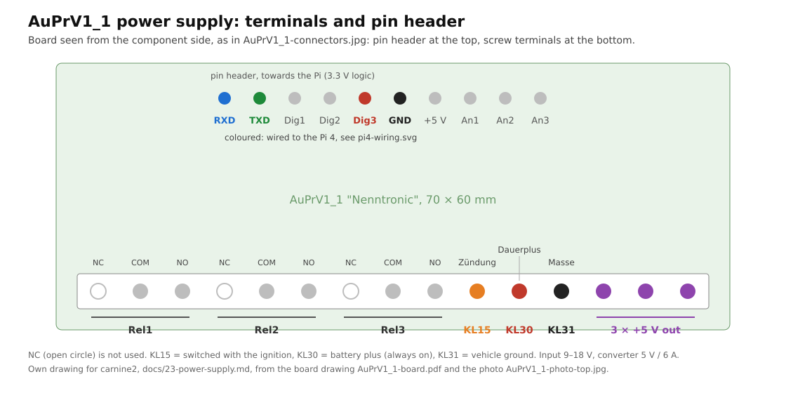
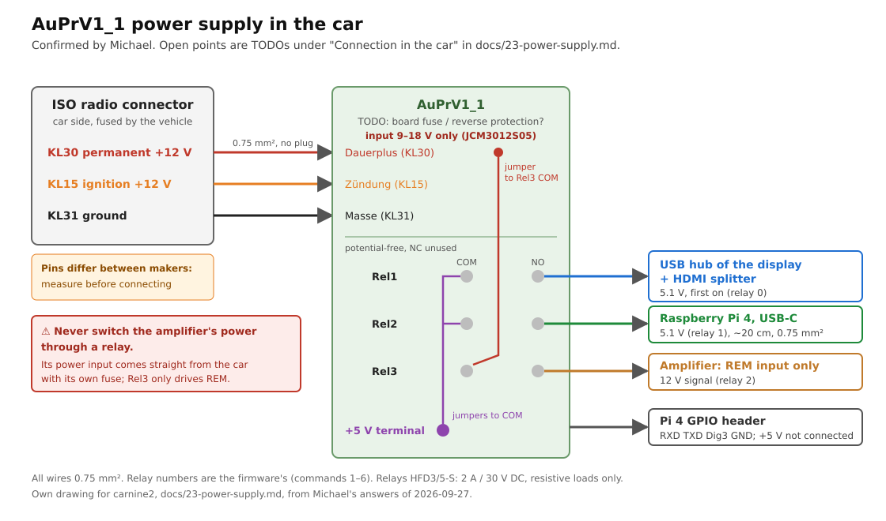
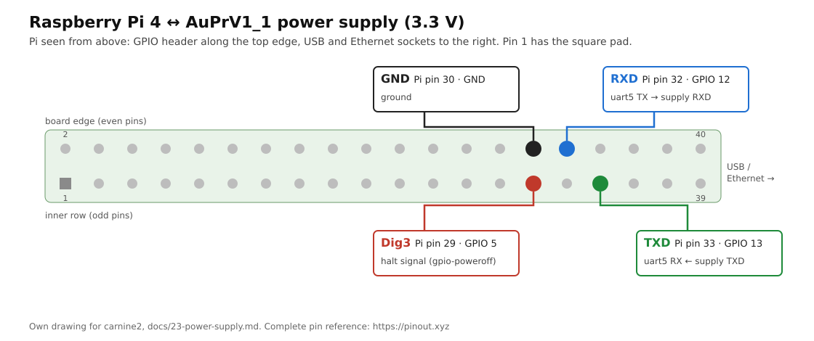

# 23 – Vehicle Power Supply (Ignition, Shutdown, Watchdog)

**Status:** not integrated yet (2026-09-27). The hardware and its firmware
come from the predecessor project
[DerKleinePunk/carnine](https://github.com/DerKleinePunk/carnine); the
firmware is now in [firmware/powersupply/](../firmware/powersupply/README.md)
and builds here. The test board runs it and talks to the test Pi over
uart5, but nothing in carnine2 talks to the supply so far.

## Why

In the car the Pi must not lose power while it writes to the SD card, and it
must not drain the battery when the car is parked. The power supply watches
the ignition (terminal 15, KL15), switches the Pi and the peripherals on and
off, gives the Pi time to shut down, and power-cycles a Pi that hangs.

## Board

**AuPrV1_1 "Nenntronic"**, 70 × 60 mm, from 2023-02: ATmega88P, three
relays, IR receiver; input 9–30 V, output 5.15 V / 4 A. Two of these exist.
Drawings: [board](hardware/power-supply/AuPrV1_1-board.pdf),
[layout](hardware/power-supply/AuPrV1_1-layout.jpg),
[connectors](hardware/power-supply/AuPrV1_1-connectors.jpg) (old names
`MichaelNenninger_Power_a3.pdf`, `RaspberryNetzteil*.jpg`). The old project
also has a UPS board and a "MicroPower" board; both were experiments that did
not work out and are not used.

### AuPrV1_1 connections

- **Screw terminals (bottom):** Rel1, Rel2, Rel3 (three contacts each),
  Zündung (KL15), Dauerplus (KL30), Masse, 3 × +5 V out.
- **Pin header (top), towards the Pi:** RXD, TXD, Dig1, Dig2, Dig3, GND,
  +5 V, Analog1–3.
- **Relays:** Rel1 = relay 0 in the firmware (display: USB hub and HDMI splitter),
  Rel2 = relay 1 (Pi power), Rel3 = relay 2 (amplifier), confirmed by
  Michael. The order matters: the displays must be on before the Pi boots.
- **USB socket and jumper (top right):** the board has its own USB-serial
  converter. A jumper connects the microcontroller's serial line either to
  the USB socket (jumper towards the socket: programming) or to the pin
  header (other side: running on the Pi). In the wrong position the Pi
  receives the supply's output but its commands never arrive.
- **Pi power:** the Pi is fed from the supply through its USB-C socket at
  5.1 V, not through the 5 V pins of its GPIO header, so it does not drop
  into undervoltage under full load. Raspberry Pi names USB-C as the Pi 4's
  power input and recommends a USB-C supply for it
  ([documentation, "Power supply"](https://www.raspberrypi.com/documentation/computers/raspberry-pi.html));
  the same page warns under "Back-powering" that power fed in elsewhere
  bypasses the Pi's protection circuitry. Michael's earlier car PCs were
  wired the same way. The +5 V pin of the supply's header is therefore not
  connected to the Pi, on purpose; the Pi gets its power only through
  USB-C.

The serial lines run at **3.3 V**, so they connect to the Pi directly,
without a level shifter.

### Terminals and pin header

Screw terminals, from left to right with the board seen from the component
side (pin header at the top):

| Position | Label | Use |
|---|---|---|
| 1–3 | Rel1 | relay 0: USB hub of the display and HDMI splitter, 5 V; NC, COM, NO |
| 4–6 | Rel2 | relay 1: Pi power; NC, COM, NO |
| 7–9 | Rel3 | relay 2: amplifier's remote input (REM), 12 V; NC, COM, NO |
| 10 | Zündung | **KL15**, plus switched by the ignition; the firmware reads it |
| 11 | Dauerplus | **KL30**, battery plus, always on; feeds the supply |
| 12 | Masse | **KL31**, vehicle ground |
| 13–15 | +5 V | 5.15 V output, up to 4 A in total |

Pin header, from left to right: RXD, TXD, Dig1, Dig2, Dig3, GND, +5 V,
Analog1, Analog2, Analog3. RXD, TXD, Dig3 and GND go to the Pi (see
[Wiring to the Pi 4](#wiring-to-the-pi-4)); Dig3 carries the Pi's halt
signal for the kernel shutdown. Dig1, Dig2 and Analog1–3 are free and have
no function yet. The board drawing
([AuPrV1_1-board.pdf](hardware/power-supply/AuPrV1_1-board.pdf)) shows two
more pads after Analog3, labelled 3.3 V and "unbenutzt" (unused), which
the connector drawing leaves out.

The KL15, KL30 and KL31 names are the usual German terminal numbers
(DIN 72552).

### Connection in the car

carnine2 is an open-source project and is not described for a particular
vehicle. The supply connects to the car radio's ISO connector; its pin
assignment depends on the vehicle and is checked with a meter before
connecting. As Michael described it on 2026-09-27:

- **KL30, KL15 and ground come from the ISO connector,** with the wires
  going straight into the screw terminals, without another plug. Ground is
  assumed to come from there as well, since everything else does; this is
  not confirmed.
- **Measure before connecting.** Which ISO pins carry permanent and
  switched plus differs between makers. With the ignition off only KL30
  must carry 12 V; with the ignition on both do.
- **Fuses** are not part of this setup: the radio connector is taken to be
  fused by the vehicle.
- **Mounting:** the board sits right next to the Pi, so the line to the Pi
  stays short: about 20 cm, 0.75 mm².
- **Relays are potential-free contacts.** The board does not put any
  voltage on them; which voltage a relay switches is set by the wiring, so
  the board can serve other uses as well. Each relay has three terminals,
  from left to right NC, COM and NO (terminal strip at the bottom); NO
  closes when the relay is on. On all three, COM and NO are used and NC is
  free.
  - **Rel1:** a wire jumper from a +5 V terminal to COM; NO feeds the
    display's USB hub and the HDMI splitter.
  - **Rel2:** wired the same way, +5 V jumpered to COM, NO to the USB-C
    cable of the Pi.
  - **Rel3:** a wire jumper from the Dauerplus terminal (KL30) to COM; NO
    goes to the amplifier's remote input (REM), the control pin that turns
    it on and off.

> **Warning:** Rel3 switches only the amplifier's remote input. A car
> amplifier takes its power through a separate heavy cable straight from
> the vehicle, with its own fuse. Never switch that power through one of
> the board's relays: it cannot carry the current and burns.

**TODO** (Michael is asking; not documented until answered):

- whether the board has its own fuse or reverse-polarity protection (asked
  the board's developer);
- the relay type and contact rating;
- a source that explains why the Pi should be fed through USB-C rather
  than the header; until then the link to the Raspberry Pi documentation
  above stands, for what it says and no more.

Still open: wire sizes for KL30, ground, KL15 and the relay outputs.

### Wiring to the Pi 4

The supply gets its own UART, **uart5**, so Bluetooth keeps the Pi's default
UART; uart4 is not used because GPIO 8/9 belong to SPI0, which a CAN adapter
(MCP2515) needs.

| Supply | Pi 4 | Header pin |
|---|---|---|
| RXD | GPIO 12, uart5 TXD | 32 |
| TXD | GPIO 13, uart5 RXD | 33 |
| Dig3 | GPIO 5, `gpio-poweroff` | 29 |
| GND | GND | e.g. 30 or 34 |

RXD and TXD on the supply are taken as its own receive and transmit line,
so they cross over to the Pi's TX and RX (checked on the device). If
`/dev/powersupply` shows nothing, swap the two wires with the Pi switched
off; if it shows output but `v` gets no answer, check the jumper. The old project wired RXD/TXD to the default UART (GPIO 14/15); with
uart5 the cable goes to pins 32/33 instead. The full header is on
[pinout.xyz](https://pinout.xyz). The backend package's udev rule
(`61-carnine-powersupply.rules`) names the line `/dev/powersupply`, whatever
ttyAMA number it gets.

**Image:** `uart5` is always enabled (it is unused without a supply). The
halt signal only with `-t power_supply:auprv1` when building the image,
because the overlay's README requires a supply that really cuts power when
signalled; without one, powering off ends in a kernel BUG and the Pi keeps
drawing current. Without the parameter the line is in `config.txt` commented
out. `active_low` also pulls GPIO 5 low on a reboot and early in the boot;
the firmware only looks at Dig3 in POWEROFF, so that does no harm.

## Firmware (V2.3.0)

[firmware/powersupply/](../firmware/powersupply/README.md), taken over from
the old project (V2.2.12); V2.3.0 gives the Pi more time to boot (see
[What carnine2 needs for it](#what-carnine2-needs-for-it)). ATmega88P at 8 MHz. `./build.sh` builds it on
Linux (with a container when `avr-gcc` is not installed) into
`build/RaspberryPower.bin`.

**Flashing** is done with a Windows program through the bootloader, over the
board's own USB socket with the jumper towards it: build here, copy the
`.bin` to Windows, write it from there, set the jumper back. The command `U`
resets the chip into the bootloader. Done on 2026-09-25 on the test board:
it ran an older firmware before (a text line every second, no telegrams, no
reaction to commands); with V2.2.12 the telegrams come and `v` answers. The test board runs V2.3.0
now; `v` reports it. Which bootloader and
protocol that is, is being asked; if it is a standard one, flashing and later
updates could run from the Pi itself. Putting on or updating the bootloader
itself is separate from the firmware.

### Serial line

38400 baud, 8N1. The Pi sends single ASCII characters, the supply answers and
reports in small binary telegrams `STX <id> <payload> ETX` (STX 0x02, ETX
0x03).

**Every second** the supply sends:

| Telegram | Payload |
|---|---|
| `STX 0x10 … ETX` | KL15: `'0'` or `'1'` |
| `STX 0x11 … ETX` | alive counter, decimal digits |
| `STX 0x12 … ETX` | state as a digit: `0` IDLE, `1` POWERON, `2` PIBOOT, `3` RUN, `4` POWEROFF |
| `STX 0x14 … ETX` | supply voltage in 0.1 V, decimal digits |

Every command is answered with `STX 0x13 <ACK 0x06 | NACK 0x15> ETX`. With
debug output on (a switch kept in the EEPROM, **on by default**) plain text
lines ending in `\n`, partly with VT100 screen codes, are mixed into the same
stream; a receiver must skip them.

**Commands from the Pi:**

| Char | Effect |
|---|---|
| `+` | alive (heartbeat) |
| `$` | the Pi shuts down: amplifier off, state POWEROFF, 15 s until power off |
| `1` `2` `3` | relay 0 / 1 / 2 on |
| `4` `5` `6` | relay 0 / 1 / 2 off |
| `!` / `?` | service mode on (watchdog off) / off |
| `*` + digit | power-on delay 1–9 s, stored in the EEPROM |
| `v` | firmware version as text |
| `#` | toggle debug output (stored in the EEPROM) |
| `U` | reset into the bootloader |

### States

| State | Entered when | Does | Leaves when |
|---|---|---|---|
| IDLE | power-off finished | microcontroller sleeps | KL15 on → POWERON |
| POWERON | KL15 on | relay 0 on (display) | after the power-on delay → PIBOOT; KL15 off → IDLE |
| PIBOOT | delay over | relay 1 on (Pi power), boot timer 60 s (V2.2.12: 30 s) | timer over → RUN; KL15 off at that point → POWEROFF |
| RUN | Pi booted | watchdog active | KL15 off → POWEROFF (15 s); no alive → POWEROFF (5 s) |
| POWEROFF | KL15 off, `$`, or watchdog | amplifier off, count down | timer over **or Dig3 active** → all relays off → IDLE |

- **Watchdog:** the alive counter is capped at 3 and drops by one per second
  in RUN (not in service mode). `+` raises it, and so do most other
  commands (not `4`, `!`, `?`, `*`, `v`). Without a `+` for
  about 3 seconds the supply cuts the Pi hard.
- **Service mode** (`!`) stops the watchdog until `?` or until the supply
  itself restarts; it is kept in RAM only.
- **Pi halted:** with `dtoverlay=gpio-poweroff,active_low=1,gpiopin=5` in
  `config.txt` the Pi signals on GPIO 5 that it has halted. Wired to Dig3,
  the supply switches off at once instead of waiting the full 15 s. Another
  GPIO works too; Dig3 is fixed unless the firmware changes.

## What carnine2 needs for it

Nothing of this is built yet.

- **Image:** done – `uart5`, optional `gpio-poweroff`, `/dev/powersupply`
  (see [Wiring to the Pi 4](#wiring-to-the-pi-4)). The serial console is not
  on any UART, and the backend service is already in `dialout`.
- **Backend** ([#36](https://github.com/DerKleinePunk/carnine2/issues/36)): a power module with its own configuration section, off by
  default, testable in WSL on a pseudo-terminal like the GPS source. It sends
  `+` regularly, reads KL15, voltage and state, shuts the Pi down through
  logind when the supply goes to POWEROFF, and sends `$` when the Pi shuts
  down on its own. State over gRPC plus a command in `media_grpc_client`.
- **Timing to check on the device:**
  - The alive `+` must start within about 63 s of the Pi getting power
    (V2.3.0: 60 s PIBOOT, RUN starts with the alive counter at 3), or the
    supply cuts a Pi that is still booting. A `+` sent in PIBOOT counts
    too, up to 3. V2.2.12 allowed only about 31 s: 30 s PIBOOT and the
    counter at 1. Measured with V2.2.12 on the test board on 2026-09-25: PIBOOT 30 s → RUN →
    `Alive time out !` 1 s later → POWEROFF 5 s → IDLE → POWERON again,
    every 39 s while KL15 is on; the relays click each round. On the test
    Pi the backend is up 7.7 s after the kernel starts (systemd), plus the
    Pi's own firmware boot before that.
  - Shutdown must finish within 15 s, unless Dig3 reports the halt; the
    backend alone may take up to 10 s to stop (`TimeoutStopSec`).
  - The firmware can be changed where these do not fit.
- **Amplifier relay:** switching the amplifier on after the audio stream is
  open and off before it closes would hide the HDMI pop on the car radio.

The old C++ implementation (`src/backend/communication/PowerSupplySerial.cpp`
in the old project) sends `+` on every status telegram and schedules the
shutdown through logind one second after POWEROFF.
